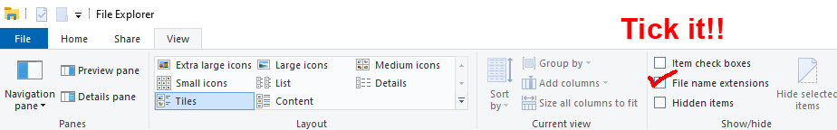
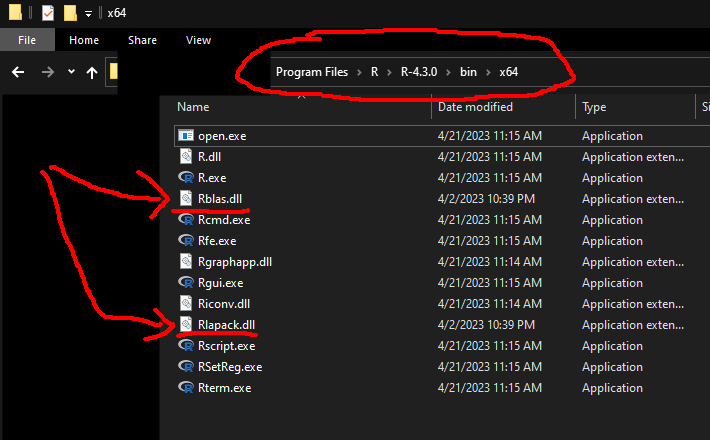
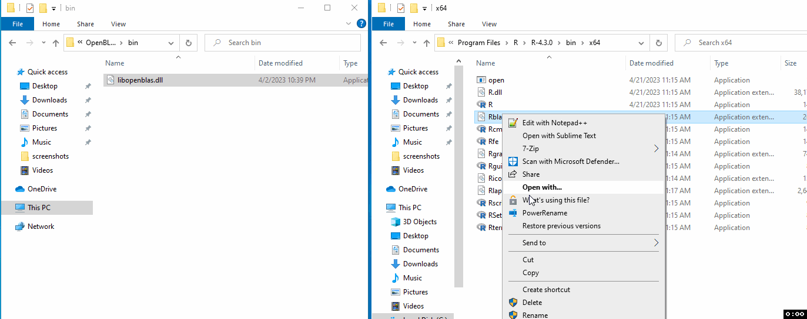
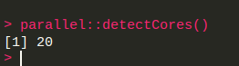
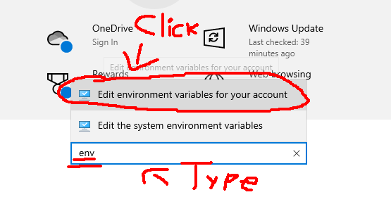
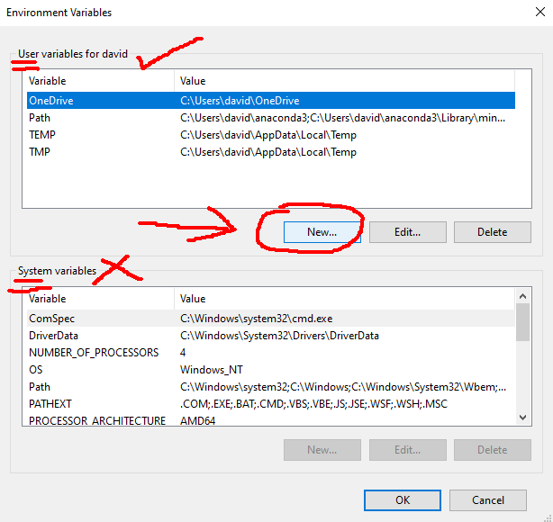
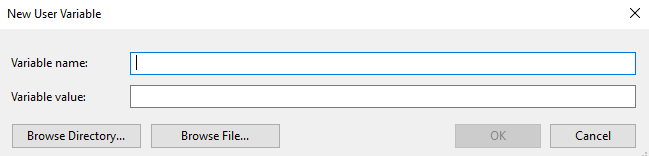
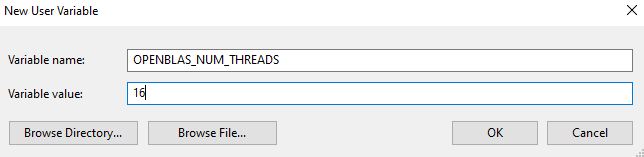

# Using OpenBLAS in R for Windows

This is a short post illustrating how to easily get R for Windows to use OpenBLAS as the backend for linear algebra operations.

Most tutorials out there are about building R itself with OpenBLAS from source which is very complex, but this is not necessary as long as one is willing to make the installation some ~120mb heavier, which should not be a problem with today's hard disks.

In short: R comes with two DLL files `Rblas.dll` and `Rlapack.dll`, containing functions from BLAS and LAPACK, respectively. These can be replaced with other DLL files implementing the same interfaces, such as `libopenblas.dll` or `libmkl_rt.dll`. This tutorial illustrates how to replace these files with OpenBLAS'es more optimized versions.

### What is OpenBLAS?

[OpenBLAS](https://www.openblas.net) is a [BLAS](https://en.wikipedia.org/wiki/Basic_Linear_Algebra_Subprograms) (basic linear algebra sub-routines) and [LAPACK](https://en.wikipedia.org/wiki/LAPACK) (linear algebra package) backend, for performing fast linear algebra operations - examples: matrix multiplications, solving linear systems, calculating eigenvalues, among many others. These sound like trivial operations, but their execution speed can vary a lot across different software, so the specific backend used for them matters.

By default, R for Windows ships its own un-optimized BLAS and LAPACK replacements, which do the job in the sense that they offer all the necessary functionality (for R) and compute the results correctly, but are much slower than optimized BLASes as they do not exploit all the features of modern CPUs.

### What difference does it make?

This is a time comparison of a simple operation (matrix multiplication) with the default R BLAS and with OpenBLAS:
```r
library(microbenchmark)
set.seed(1)
m <- 1e4
n <- 1e3
k <- 3e2
X <- matrix(rnorm(m*k), nrow=m)
Y <- matrix(rnorm(n*k), ncol=n)
microbenchmark({
    Z <- X %*% Y
}, times=10L)
```

When ran on my own setup (AMD Ryzen 7 2700, 8c/16t, 3.2GHz), I obtain the following timings:

* With R's BLAS:
```
Unit: seconds
                 expr      min       lq     mean   median      uq      max neval
 {     Z <- X %*% Y } 2.035071 2.060824 2.072882 2.069541 2.09677 2.104811    10
```

* With OpenBLAS:
```
Unit: milliseconds
                 expr     min      lq     mean  median       uq      max neval
 {     Z <- X %*% Y } 58.6489 71.2553 83.42615 72.7103 104.9017 110.6942    10
```

That is to say: using OpenBLAS made the operation almost 30x faster. No changes in the code were required, and it will speed up operations from CRAN packages which rely on BLAS too.


### What you will need

The following will be required in order to follow the next steps:
* Write access to the folder where R is installed. If R was installed with the default options in the installer, saying 'Yes' to all, this means that administrator rights will be required.
* Some compression/de-compression software that could extract compressed zip files, such as [7-zip](https://www.7-zip.org).

### Instructions in detail

* Close any R/RStudio session currently running, if there is any.

* Download the latest version of OpenBLAS for Windows from their [GitHub releases page](https://github.com/xianyi/OpenBLAS/releases) - **be sure to download the right version** for your platform. Most likely, will be named similarly to this (as it was on version 0.3.23):


* De-compress (un-zip) the file. If using 7-zip, this can be done by right-clicking the file, selecting '7-zip' and then 'Extract to ...' or similar.


* Configure your windows explorer to show file extensions: click "View" at the top bar and tick "File name extensions".


* Inside the folder where the file downloaded two steps above was extracted, locate a subfolder with a file named `libopenblas.dll`, which should **NOT** be under the same folder as other files ending in `.a` (or if it does, make sure that the file weights several dozen megabytes at least). Most likely, this will be under a folder `lib` in the path where the archive was decompressed.


* Locate the folder where R itself is installed. Typically, this should be something like: `C:\Program Files\R\R-4.3.0` (or some other version depending on what you have installed).
* Within the R folder, locate the sub-folder `bin\x64` (e.g. `C:\Program Files\R\R-4.3.0\bin\x64`).
* In this folder there should be two key files: `Rblas.dll` and `Rlapack.dll`. Copy them somewhere else to have a backup if anything goes wrong.


* Delete these two files (`Rblas.dll` and `Rlapack.dll`) from `bin\x64`.

* Copy the openblas dll file which was extracted from the zip file to this same folder **twice** (see GIF video below).

* Rename one of the copies as `Rblas.dll` and the other as `Rlapack.dll`. Hint: under the default window settings, file extensions will be hidden, in which case the `.dll` part should be left ot when renaming them (see GIF video below).

* **Optionally**, or if you start getting errors about a missing DLL when re-installing packages, leave a third copy of the the DLL from the zip file in this same folder, but with its original name (e.g. `libopenblas.dll` - that is, there should be 3 copies of the same file, with names `Rblas.dll`, `Rlapack.dll`, and `libopenblas.dll`). See GIF video below:




At this point you're done and the next time you start R it will already be using OpenBLAS for accelerated linear algebra operations.

### Controlling number of threads

OpenBLAS supports multi-threading, which can be controlled dynamically through the package `RhpcBLASctl`, or can be controlled through an environment variable `OPENBLAS_NUM_THREADS`. Importantly, **this environment variable needs to be set before R is started**, which can be done by setting it up through the windows control panel. This tutorial illustrates how to set the variable.

* First, you'll need to find out the maximum number of threads that your CPU supports. This can be known by running the R function `parallel::detectCores()`:


* With that number being known, now you can configure this as the default for OpenBLAS. First, go to the control panel (click the windows start button and select "Settings"):


* In the control panel, search for "environment variables" and choose the option for editing them:


* In the menu that pops up, choose to add a new variable for your user:


* Name the variable as `OPENBLAS_NUM_THREADS` and set the value for it that you got from `parallel::detectCores()` (here it is set to 16):



* Reboot your computer. Next time R is started, OpenBLAS will be configured to exploit all the available threads from your CPU to run faster.
